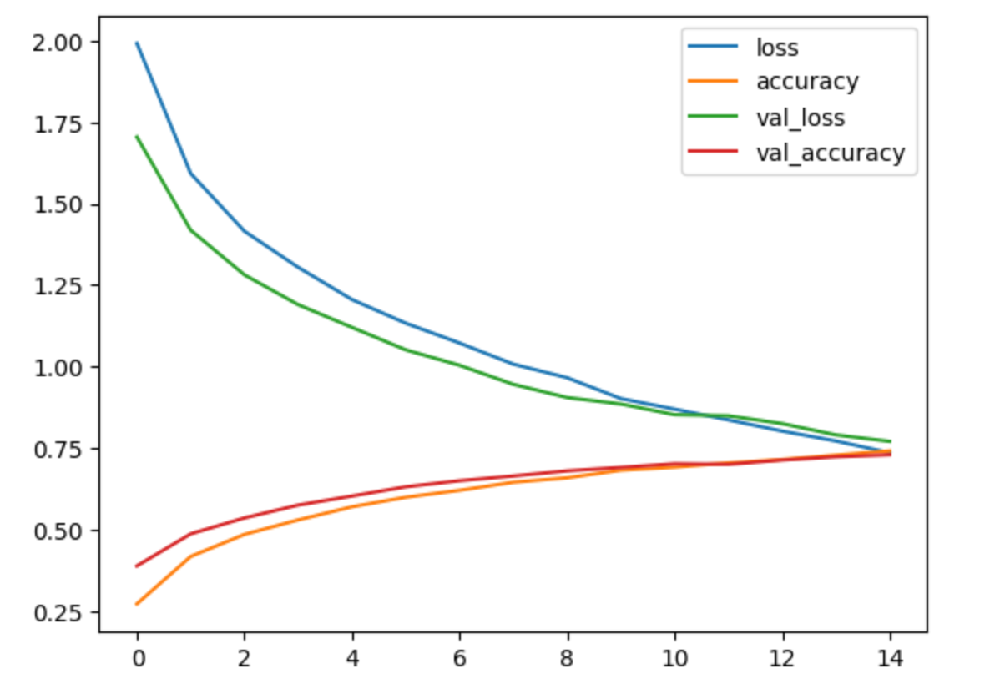
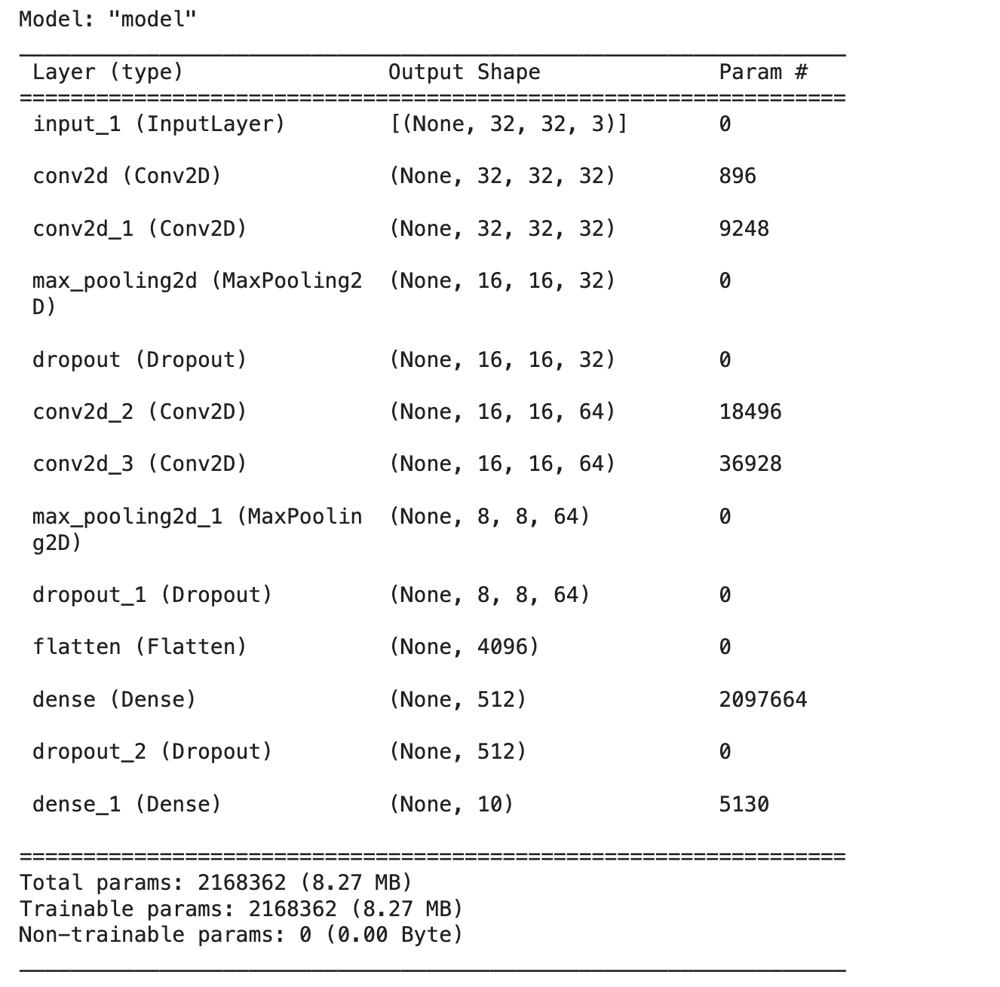
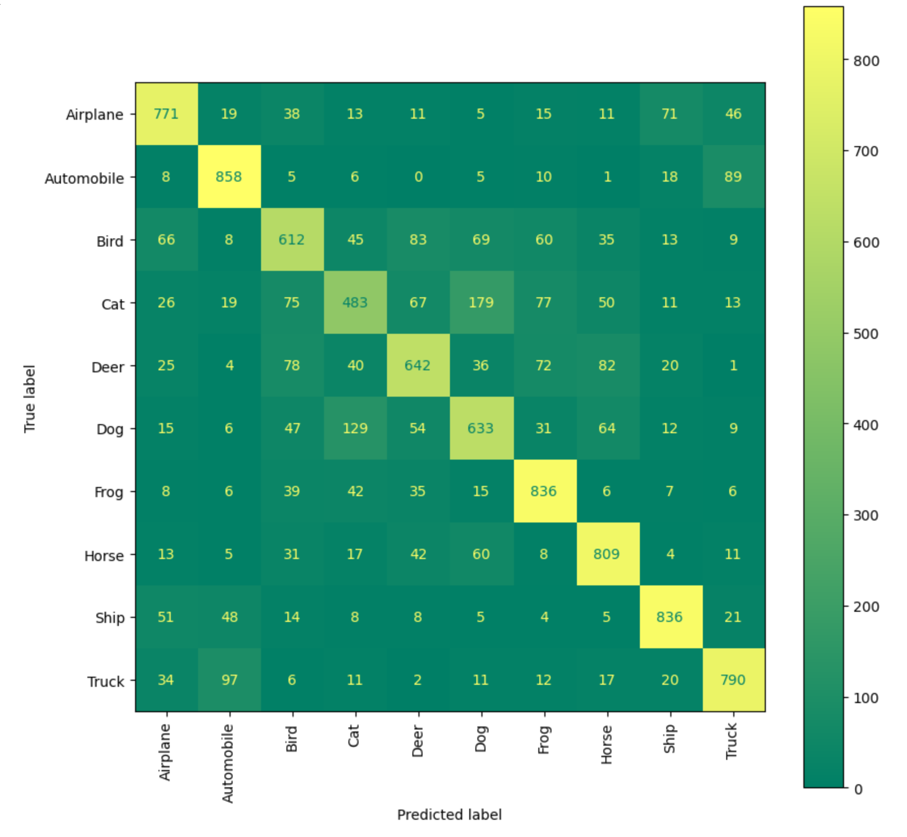

# Implementation of a CNN Model for CIFAR-10 Dataset with Validation Split

This project implements a Convolutional Neural Network (CNN) to classify images in the CIFAR-10 dataset. The dataset consists of 60,000 32x32 color images in 10 classes, with 6,000 images per class. The project involves loading and preprocessing the data, defining and training the model, evaluating its performance, and visualizing the results.

## Table of Contents

- [Introduction](#introduction)
- [Requirements](#requirements)
- [Usage](#usage)
- [Results](#results)
- [File Description](#file-description)
- [Notes](#notes)

## Introduction

This project implements a CNN for image classification on the CIFAR-10 dataset. The process includes:
- Data loading and preprocessing
- Model definition using the Keras Functional API
- Model training and evaluation
- Visualization of training history and model architecture
- Displaying misclassified examples and confusion matrix

## Requirements

- Python 3.x
- NumPy (`numpy`)
- Pandas (`pandas`)
- Keras (`keras`)
- Matplotlib (`matplotlib`)
- Scikit-learn (`scikit-learn`)

You can install the required packages using the following command:
```bash
pip install numpy pandas keras matplotlib scikit-learn
```

## Usage

To run the script, use the following command:
```bash
python cnn_cifar10.py
```
## Results

### Training History
Final model gave such results:
```
Test loss: 0.7987345612348901  
Test accuracy: 0.831298734567890
```

After training the model, the training and validation accuracy and loss are plotted and saved as `history_plot.png`.



### Model Architecture
The architecture of the CNN model is visualized and saved as `model_plot.png`.



### Misclassified Examples
The script displays five misclassified examples from the test set.

### Confusion Matrix
The confusion matrix for the test set is plotted and saved as `confusion_matrix.png`.



## File Description

### `cnn_cifar10.py`
This script contains the main logic for loading the CIFAR-10 dataset, defining the CNN model, training and evaluating the model, and visualizing the results.

## Notes

This is a basic implementation and can be extended to include features like:
- Data augmentation for better generalization
- Experimenting with different network architectures
- Hyperparameter tuning for improved performance
